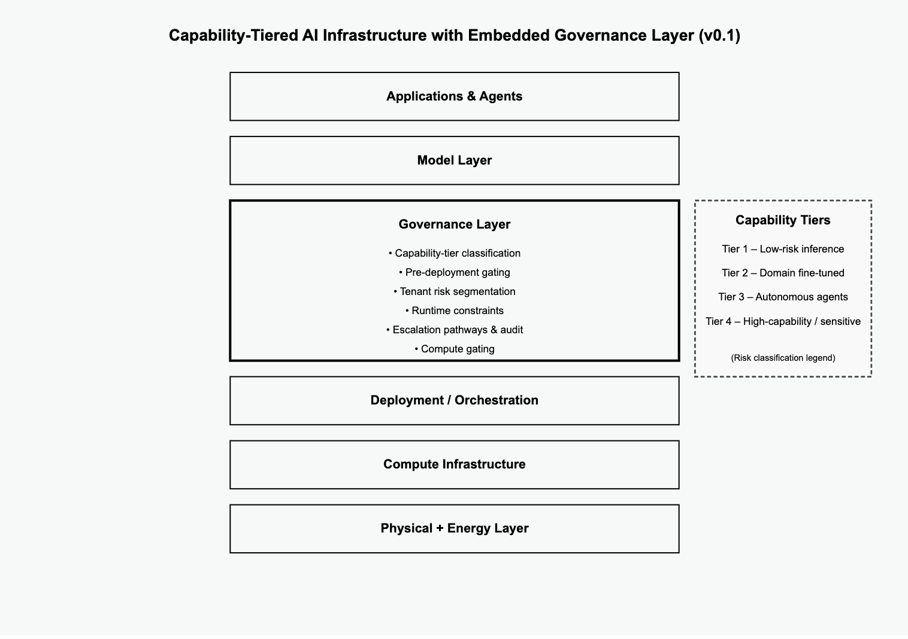

# AI Governance Project

**Version:** v0.6  
**Status:** Strategic Architecture Phase  
**Lead:** Federico Blanco Sánchez-Llanos  
**Date:** February 2026

## Executive Framing

Advanced AI systems are evolving from assistive tools into persistent, economically active agents embedded within economic and institutional infrastructures.

Existing governance approaches often treat these systems as a single regulatory category, creating structural blind spots.

The AI Governance Project develops a capability-tiered governance and enforcement doctrine aligned with system autonomy, persistence, planning capacity, economic agency, and infrastructural leverage.

The objective is not reactive regulation — but structural synchronization between capability expansion and governance maturity.

As enforcement migrates into infrastructure, jurisdiction, sovereignty, and power distribution become design variables rather than external policy considerations.

This repository develops that architecture and its sovereign implications step by step.

## Premise

The term “AI” currently collapses fundamentally different system types into a single regulatory category.

Stateless predictive tools, enterprise workflow agents, autonomous operational systems, economically active agents, sovereign-scale compute deployments, and decentralized rogue actors cannot coherently share the same governance regime.

Effective governance must map to capability — not branding.

As capability growth accelerates, governance must evolve proportionally.  
The question is not whether advanced AI systems will emerge — but whether enforcement infrastructure matures alongside them.

## Structure of the Research Series

### [Note I — The AI Agent Spectrum](./notes/note-01-ai-agent-spectrum.md)
Introduces a capability-based classification of AI systems.

**Core thesis:** Governance must be capability-tiered.

Defines a spectrum based on:  
- Autonomy  
- Persistence  
- Goal formation  
- Economic participation  
- Infrastructure access  
- Identity continuity

### [Note II — From Agent Spectrum to Governance Architecture](./notes/note-02-from-agent-spectrum-to-governance-architecture.md)
Transitions from classification to structural governance implications.

**Core thesis:** Governance must move from declarative regulation to infrastructural architecture.

Explores:  
- Why uniform regulation fails  
- How governance attaches to leverage points  
- Compute, energy, identity, and infrastructure as control surfaces  
- Enforcement as a system layer

### [Note III — Capability-Tiered Governance & Enforcement Architecture](./notes/note-03-capability-tiered-governance-enforcement.md)
Formalizes governance maturity alignment and enforcement topology.

**Core thesis:** As AI systems gain persistence, planning capacity, and economic agency, governance must migrate from policy toward embedded runtime architecture.

Introduces:  
- A four-tier capability spectrum  
- Governance maturity alignment  
- Runtime constraint layers  
- Verification architecture  
- Enforcement node networks  

Enforcement becomes an architectural synchronization challenge.

### [Note IV — Enforcement Primitives & Runtime Constraint Architecture](./notes/note-04-enforcement-primitives.md)

Formalizes interoperable enforcement primitives and establishes Compute Gating as the sovereignty hinge.

**Core thesis:** Policy does not scale at machine speed. Infrastructure does.

Governance must embed into runtime systems through interoperable enforcement primitives, with compute gating anchoring sovereign control over scalable capability.

Defines:  
- A taxonomy of enforcement primitives  
- Compute gating regimes by capability tier  
- Distributed enforcement topologies  
- Geopolitical leverage and structural failure modes  

Sovereign leverage in advanced AI ecosystems increasingly correlates with control over scalable compute access.

# Architecture Overview

## Capability-Tiered AI Infrastructure  
with Embedded Governance Layer

Diagram version: v0.1  
Architecture status: Conceptual structural model (non-normative)

## Structural Claim

This framework positions **governance** as an **embedded control layer** between model capability and deployment orchestration.

Governance is implemented as **enforcement logic** — including:

- Capability classification
- Compute gating
- Runtime constraints
- Escalation pathways

— rather than post-deployment policy.

The objective is **structural risk containment** at the infrastructure layer.

## Emerging Phase: Jurisdiction & Sovereignty

The next phase of this work develops the jurisdictional and sovereign implications of enforcement architecture.

As enforcement becomes infrastructural and partially autonomous, key questions emerge:

- Where does jurisdiction attach in distributed AI systems?  
- Who governs enforcement nodes?  
- How do sovereign compute regimes interact?  
- How is cross-border enforcement coordinated or contested?  
- What prevents enforcement concentration from becoming systemic power capture?

Governance architecture in advanced AI ecosystems intersects directly with sovereignty design.

## Risks & Structural Tensions

Any enforcement architecture introduces structural tradeoffs. This project explicitly examines:

- Centralization and concentration risk  
- Regulatory capture risk  
- Sovereign fragmentation  
- Innovation suppression through over-constraint  
- Governance infrastructure becoming geopolitical leverage  

These risks are not peripheral — they are integral to the design problem.

## Project Approach

This initiative proceeds sequentially:

1. Map the terrain  
2. Clarify capability categories  
3. Identify structural leverage points  
4. Develop enforcement architecture models  
5. Analyze jurisdictional and sovereign implications  
6. Articulate strategic doctrine considerations  

Analytical foundations precede policy positioning.

## Non-Goals

This repository does not:

- Propose a global centralized AI authority  
- Advocate premature capability caps  
- Promote broad surveillance expansion  
- Restrict open research by default  
- Assume a single geopolitical governance model  

The work focuses on structural alignment and sovereignty-aware architecture — not prescriptive overreach.

## Working Assumptions

These assumptions are examined, not asserted:

- AI systems will increase in autonomy and persistence  
- Economically active agents will proliferate  
- Compute concentration will shape geopolitical leverage  
- Governance will increasingly attach to infrastructure  
- Enforcement cannot remain purely declarative  
- Sovereignty will increasingly map to control over scalable compute and enforcement nodes  

## Initiative Position

This repository represents early-stage development of a capability-tiered governance and enforcement doctrine for advanced AI systems.

It aims to complement — not replace — existing frameworks such as:

- ISO/IEC JTC 1/SC 42  
- NIST AI Risk Management Framework  

The contribution is structural:  
- Capability-tiered alignment  
- Enforcement architecture modeling  
- Sovereignty-aware governance design  

## Objective

The objective is to:

- Formalize classification frameworks  
- Define enforcement architecture requirements  
- Model interoperable enforcement primitives  
- Clarify jurisdictional attachment points  
- Develop sovereignty-aware governance doctrine  
- Contribute to emerging standards discourse  

This remains an architectural and strategic exploration phase.

Future iterations may include:  
- Draft technical specifications  
- Reference enforcement topologies  
- Sovereign compute governance models  
- Collaborative standards alignment  

## Audience

- Governance advisors  
- Policy designers  
- Infrastructure architects  
- National security analysts  
- Institutional leaders  
- AI systems designers  
- Sovereign technology strategists  

## Collaboration & Engagement

The AI Governance Project welcomes substantive engagement from researchers, institutional leaders, and practitioners working at the intersection of AI systems design, enforcement architecture, and sovereignty.

We particularly welcome:

- Research on enforcement primitives or runtime constraint systems  
- Feedback on capability-tiered classification  
- Proposals for verifiable identity or cross-agent verification models  
- Perspectives on sovereign compute regimes  
- Jurisdictional coordination models  
- Power-distribution analysis in enforcement networks  

Focused structural critique is encouraged.

### How to Engage

If your work intersects with capability-tiered governance, enforcement architectures, identity continuity, jurisdictional attachment, interoperable enforcement nodes, or sovereign compute regimes:

→ Open an issue describing the overlap or proposed contribution.

For deeper discussion, formal critique, collaborative refinement, or potential standards alignment:

→ Contact the project lead directly.

Please reference specific notes or architectural elements to ensure focused dialogue.

## Contact

**Federico Blanco Sánchez-Llanos**  
Email: fsllanos@gmail.com  
LinkedIn: [linkedin.com/in/fedblanco](https://www.linkedin.com/in/fedblanco)

## License

Creative Commons Attribution–NonCommercial 4.0 International (CC BY-NC 4.0).

Commercial use, institutional embedding, or derivative advisory applications require explicit permission.
